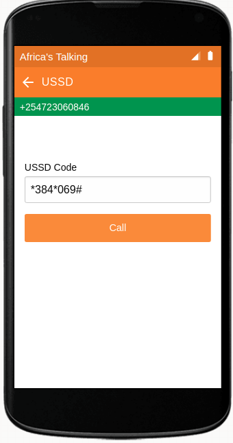
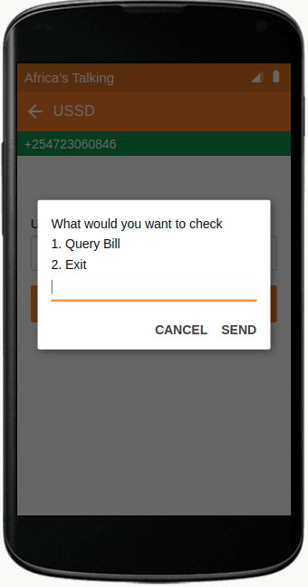
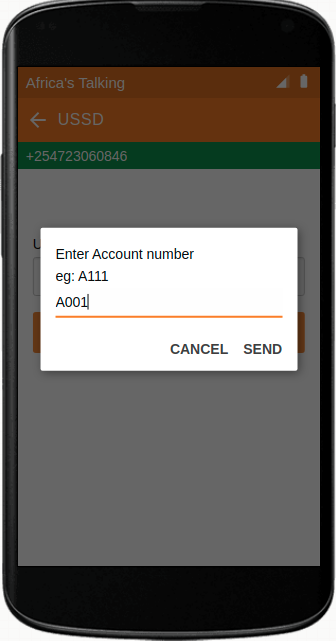
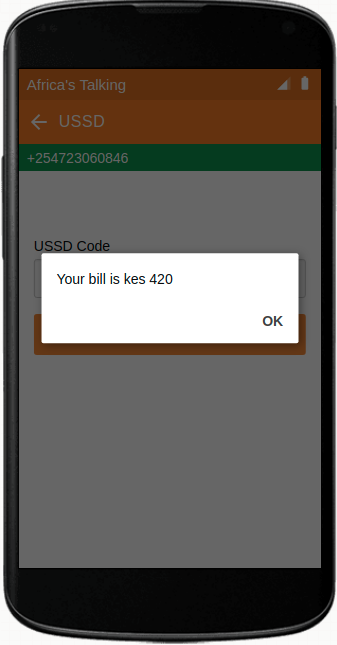

<h1 align="center"><b>AT-USSD</b></h1>

## Setup
---

### 1. AT Developers account
1. Create your AT developer [account](https://account.africastalking.com/)
2. Login to AT developer account
3. [Go to Sandbox App](https://account.africastalking.com/apps/sandbox)

### 2. Running app locally
#### clone the repo and navigate into it
```bash
git clone 
cd 
```
#### Install dependecies
```bash
pip install -r requirements.txt
```
### Run the application
I've implemented the application logic with 2 web frameworks flask and FastAPI you can select either.
1. Flask
#### Navigate to app directory
```bash
cd flask_app/
```
#### Start server
```bash
python app .py
```
2. FastAPI
#### Navigate to app directory
```bash
cd fastapi_app/
```
#### Start server
```bash
uvicorn main:app --reload
```
### 3. Port forwading with ngrok
```bash
ngrok http <port number>
```

### 4. Create a USSD service code
1. Create a [new USSD channel](https://account.africastalking.com/apps/sandbox/ussd/channel/create)
The following information is needed to create the channel:
    - `Service code` this is shared by default : `*384#`
    - `Channel` this is a unique number appended to the service code to differentiate your app from other apps eg: `069`
    - `Callback URL` this is a public address that is invoked by the AT API when a subscriber dails the ussd code use the exposed ngrok public url
    In my case the service code is: `*384*069#`

### 5. Outcome
| </img> 	| </img> 	|
|:----------------------------------------------:	|:----------------------------------------------:	|
| </img> 	| </img> 	|